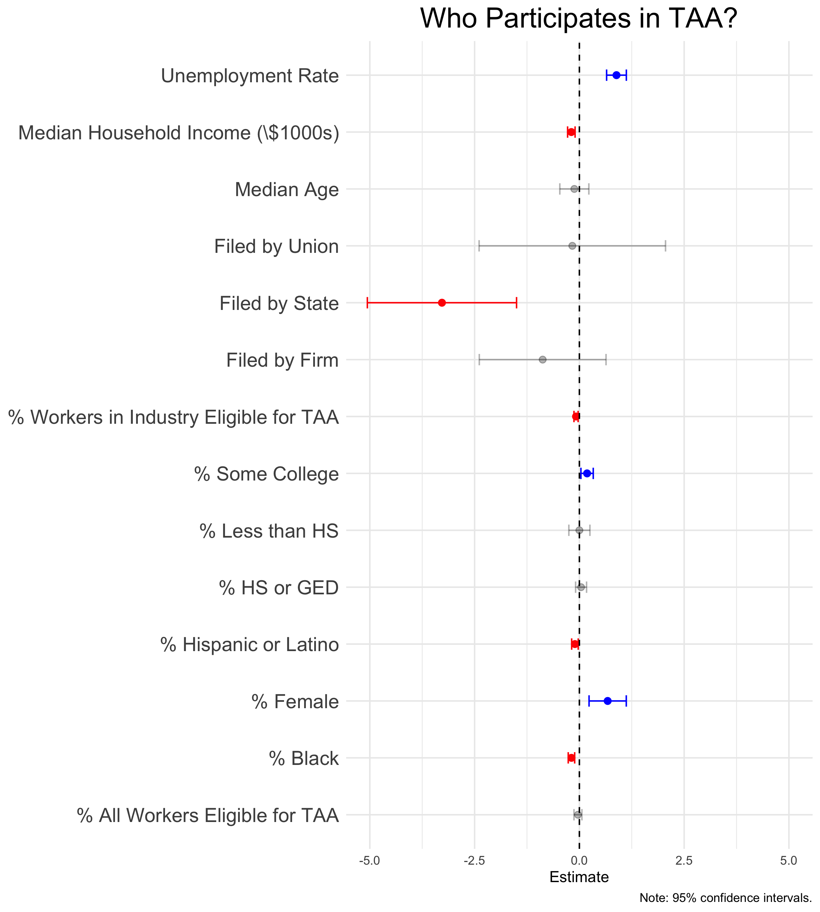

# Participation in Trade Adjustment Assistance


* Each year, the United States spends nearly \$1 billion dollars on the Trade Adjustment Assistance (TAA) program, which provides free job training to workers who lose their job due to foreign trade.
* In principle, this program should soften the cost of free trade in places like the Rust Belt by reallocating labor from the "old economy" to more globally competitive industries.
* Based on data obtained from the Department of Labor via a Freedom of Information Act (FOIA) request, we show that **less than a quarter of eligible beneficiaries participate in TAA.**
* Using data from the Bureau of Labor Statistics (BLS) and U.S. Census Bureau, we evaluate three potential explanations for this low participation rate in TAA:
    * *economic* factors that make retraining more or less attractive,
    * *programmatic* challenges that make it difficult to apply for and receive benefits, and
    * *stigma* that may face potential beneficiaries.
* Using OLS regression, we find that workers in areas with higher unemployment and higher female labor participation rates are more likely to participate in TAA, while workers who became eligible through the actions of a state workforce agency (rather than the workers themselves or their union) are less likely to participate. This lends support to **both the economic and programmatic explanations of TAA participation.**

<p align="center" width="100%">

</p>

## Repository Structure

This repository is structured as an [RStudio Project](https://support.posit.co/hc/en-us/articles/200526207-Using-RStudio-Projects). There is an [`renv`](https://rstudio.github.io/renv/articles/renv.html) (v0.15.2) lockfile which contains the library dependencies for this repository. The lockfile references package versions available on 2022-01-31. We recommend setting your package repository to the [Posit Public Package Manager](https://packagemanager.posit.co/client/#/) CRAN snapshot for that date:

``` r
options(repos = c(CRAN = "https://packagemanager.posit.co/cran/2022-01-31"))
```

* `data/` contains the data used in this project. There is a README file describing the structure of the directory.
* `scripts/` contains the `.R` scripts to wrangle the data and conduct the analysis for this project. There is a README file describing each script.
* `R/` contains custom functions sourced in R scripts. Each function has complete `roxygen2` documentation.
* `images/` contains figures output by the analysis scripts.
