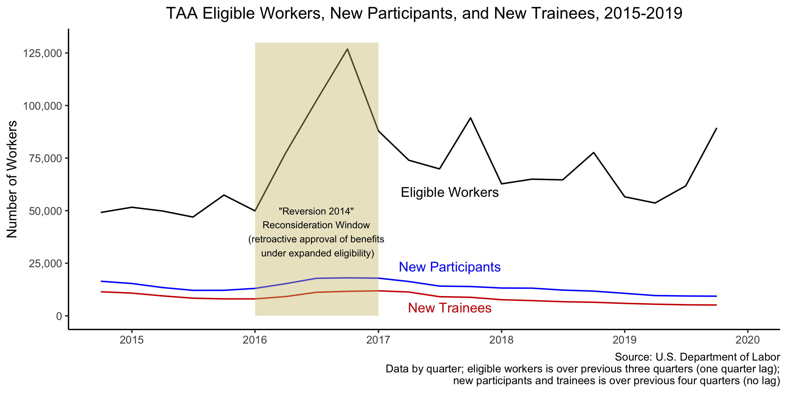

# Participation in Trade Adjustment Assistance

* Each year, the United States spends nearly \$1 billion dollars on the Trade Adjustment Assistance (TAA) program, which provides free job training to workers who lose their job due to foreign trade.
* In principle, this program should soften the cost of free trade in places like the Rust Belt by reallocating labor from the "old economy" to more globally competitive industries.
* Based on data obtained from the Department of Labor via a Freedom of Information Act (FOIA) request, we show that less than a quarter of eligible beneficiaries participate in TAA. * Using data from the Bureau of Labor Statistics (BLS) and U.S. Census Bureau, we evaluate three potential explanations for this low participation rate in TAA:
    * *economic* factors that make retraining more or less attractive,
    * *programmatic* challenges that make it difficult to apply for and receive benefits, and
    * *stigma* that may face potential beneficiaries.
* Using OLS regression, we find that workers in areas with higher unemployment and higher female labor participation rates are more likely to participate in TAA, while workers who became eligible through the actions of a state workforce agency (rather than the workers themselves or their union) are less likely to participate. This lends support to both the economic and programmatic explanations of TAA participation.

